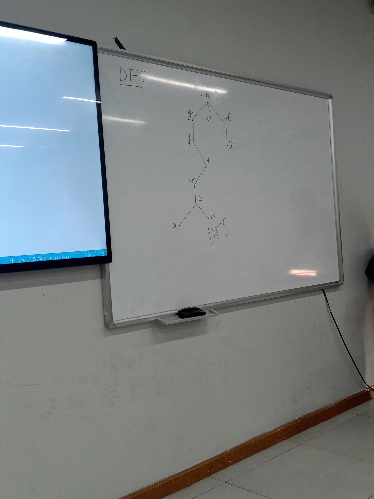

# Đồ thị cây
- **Định nghĩa**
- Cây là một đồ thị vô hướng liên thông mà không có chu trình đơn.
    + Liên thông vô hướng
    + Không có chu trình đơn

- **Định lý**
- Một đồ thị vô hướng là cây ...
## Cây có gốc
- **Định nghĩa**
- Một cây có gốc là cây có một đỉnh là gốc và mỗi cạnh đi ra trực tiếp từ gốc.

## Cây m phân
- **Định nghĩa**
- Một cây có gốc gọi là một cây m phân nếu mỗi giao điểm không có nhiều hơn m con
- Một cây gọi là m phân đủ nếu mỗi giao điểm có chính xác m con.
- Một cây m phân với m=2 được gọi là nhị phân.

- Một cây có gốc có thứ tự là cây có các con của giao điểm là có thứ tự

- **Tính chất**
1. Một cây có n đỉnh có n-1 cạnh
2. Với mọi cây m phân 
    n = i + l
3. Với mọi cây m phân đủ 
    n = $$m*i$$ + 1 
    l = $$(m - 1)*i$$ + 1
- n là số nodes
- i là số giao điểm
- l là số lá
    - **VD 1: How many leaves are there in a full 5-ary tree with 56 nodes?** 
        m = 5 (full), n = 56 
        $$i = \frac{n - 1}{m} = 11$$ 
        l = 55 - 11 = 44 
    - **VD 2: How many leaves are there in a full 5-ary tree with 56 nodes?** 
        m = 3 (full), l = 27 
        $$i = \frac{l - 1}{m - 1} = 13$$ 
        |E| = $$13 * 3$$ = 39 
        n = 39 + 1 = 40 
### Chiều cao và cấp của cây có gốc
- **Định nghĩa**
- ***Level (mức)*** của một đỉnh trong một cây có gốc là chiều dài từ một gốc tới một đỉnh
- ***Level of the root*** định nghĩa là 0
- ***Height*** là ***level*** tối đa của các đỉnh.

- **Định lý**
- Một cây m-phân có chiều cao *h* cân bằng khi tất cả các nút lá đều nằm tại *h* hoặc *h-1*
- Với một cây m-phân thì 
    $$l \leq m^{h} => h \ge \lceil\log_m(l)\rceil$$
## Cây nhị phân
- **Định nghĩa**
- Cây nhị phân là cây có cây con trái chứa các giá trị nhỏ hơn giá trị gốc và cây con phải chứa các giá trị lớn hơn cây con phải.

## Mã tiền tố
- **Định nghĩa**
- Mã tiền tố là mã mà sâu bit mã hóa không chứa các giá trị bị trùng lặp.
- **Thuật toán Huffman**
    1. Tìm tần số xuất hiện của mỗi ký tự
    2. Cấu trúc 1 cây nhị phân biểu diễn mã tiền tố của ký tự.
    **Notes:**
    - Sắp xếp tần số từ nhỏ tới lớn sau mỗi bước
    - Cây con có trọng số lớn nằm bên trái của cây nhị phân.
    
1. **VD1:** Use Huffman coding algorithm to encode the word “google” 
    google      ASCII = $$6 * 8$$ = 48 bits
    
    Bước 1:
    |char|g|o|l|e|
    |----|-|-|-|-|
    |freq|$$\frac{2}{6}$$|$$\frac{2}{6}$$|$$\frac{1}{6}$$|$$\frac{1}{6}$$|
    
    Bước 2:
    
    

    |o|1|
    |-|-|
    |g|01|
    |l|001|
    |e|000|
    |12|011101001000|
    
$$\frac{48}{12}=4$$

2. **VD2:** Use Huffman coding algorithm to encode the text “maximum”. 
What is the average number of bits? 
    maximum     ASCII = $$7*8$$ = 56 bits
    
    |char|m|a|x|i|u|
    |----|-|-|-|-|-|
    |freq|$$\frac{3}{7}$$|$$\frac{1}{7}$$|$$\frac{1}{7}$$|$$\frac{1}{7}$$|$$\frac{1}{7}$$|

    

    |m|0|
    |-|-|
    |a|111|
    |u|100|
    |x|110|
    |i|101|
    |15|011111010101000|

    Avg bits = $$\frac{15}{7} \approx 2.14 bits$$

## Duyệt cây
- **Định nghĩa** là duyệt qua tất cả các đỉnh của cây *có gốc*.
- *Pre-Order* là duyệt gốc -> trái -> phải (N -> L -> R)
- *In-Order* là duyệt từ trái -> phải (nhỏ đến lớn) (L -> N -> R)
- *Post-Order* là duyệt trái -> phải -> gốc (L -> R -> N)
    **Note**: 
    - N: Root node
    - L: Left subtree
    - R: Right substree
    
## Biểu diễn biểu thức
**Note**:
- ↑ : mũ cơ số
***Exp***:
1. What is the ordered rooted tree that represents the expression ((x + y) ↑ 2) + ((x − 4)/3)?

- **Prefix form**: + x y (x phép toán với y)
- **Infix form**: x + y 
- **Postfix form**: x y + (x phép toán với y)
=> Cần phải xác định Operator, X, Y trước để xác định Tiền tố, Trung tố và Hậu tố (Toán tử nằm đầu thì là tiền tố, toán tử nằm cuối thì là hậu tố). Vẽ chiều mũi tên hướng về phép toán.
**Solution**:
- **Prefix**: rà từ phải qua trái, gặp phép toán thì viết lại liền sau là x, liền sau x là y.
- **Postfix**: rà từ trái sang phải, gặp phép toán thì dừng lại viết theo thứ tự liền trước là y, liền trước y là x.
## Spa. Trees
- Cây là cấu trúc tối ưu nhất của một đồ thị.

  

**Tìm kiếm chiều sâu**
1. Chọn 1 đỉnh bất kỳ trong đồ thị là root.
2. Tại gốc đó, chọn đúng 1 hướng đi hết tới nốt lá rồi backtracking về vị trí liền trước đó liên tục tới khi hết cây.

***Exp**:

 

**TÌm kiếm chiều rộng**
- Tương tự nhu Tìm kiếm chiều sâu, nhưng tìm theo bậc của nút.

## Min.Span.Trees
- Một cây sinh nhỏ nhất khi tổng tất cả các cạnh là nhỏ nhất.
**Thuật toán Prim**
1. Sắp xếp thứ tự tăng dần các giá trị. Trong số các cạnh có giá trị nhỏ nhất chọn ra 1 trong số chúng làm cạnh bắt đầu.
2. Quan sát tất cả các cạnh kề với nó, cạnh nào có giá trị nhỏ tiếp theo thì mình chọn miễn là không tạo thành chu trình đơn.
***Exp***:

***//Thêm ảnh và bảng slide 81 vào.***

**Thuật toán Kruskal**
1. Sếp từ nhỏ đến lớn. Có bao nhiêu cạnh nhỏ nhất lấy ra hết miễn không tạo thành chu trình đơn.
2. Có bao nhiêu có giá trị nhỏ thứ hai thì cho vào hết miễn không tạo thành chu trình đơn.
3. so on... Cho đến khi kết thúc thuật toán.
***Exp***:

***//Thêm ảnh slide 89 vào.***

