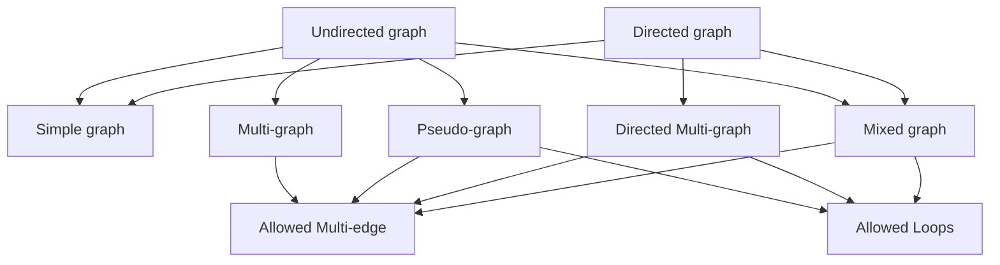

## Graph Terminology

## Types of graphs

| Graph | \|V\| | \|E\| | Degree |
|:---:  | :---: | :---: |:---:   |
|$$K_n, n \ge 1$$|n|$$\frac{n*(n-1)}{2}$$|deg(u) = n-1, $$\forall u \in V$$|
|$$K_{m, n} \ge 1$$|$$m+n$$|$$m*n$$|deg(u) = n, $$\forall u \in V_1 \newline$$ deg(v) = m, $$\forall v \in V_2 \par$$|
|$$C_n, n \ge 3$$|n|n|deg(u) = 2, $$\forall u \in V$$|
|$$W_n, n \ge 3$$|$$n+1$$|n|deg(u) = 3, $$\forall u \in C_n \par$$ deg($$*$$) = n|
|$$Q_n, n \ge 1$$|$$2^n$$|$$n*2^{n-1}$$|deg(u) = n|

## Bipartite graphs
- Make colors two adjacent edges differently colored.
