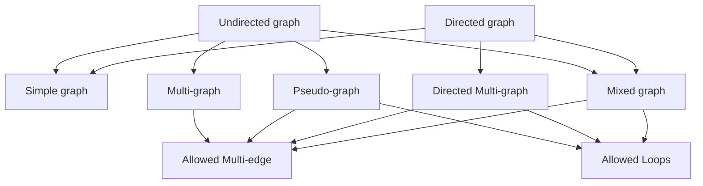

```mermaid
graph TD
    A[Undirected graph] --> C[Simple graph]
    A[Undirected graph] --> D[Multi-graph]
    D[Multi-graph] --> G[Allowed Multi-edge]
    A[Undirected graph] --> E[Pseudo-graph]
    E[Pseudo-graph] --> G[Allowed Multi-edge]
    E[Pseudo-graph] --> H[Allowed Loops]
    A[Undirected graph] --> F[Mixed graph]
    B[Directed graph] --> C[Simple graph]
    B[Directed graph] --> I[Directed Multi-graph]
    I[Directed Multi-graph] --> G[Allowed Multi-edge]
    I[Directed Multi-graph] --> H[Allowed Loops]
    B[Directed graph] --> F[Mixed graph]
    F[Mixed graph] --> G[Allowed Multi-edge]
    F[Mixed graph] --> H[Allowed Loops]
```
```mermaid
graph TD
    A[Cha] --> B[Con 1]
    A --> C[Con 2]
    B --> D[Cháu 1]
    B --> E[Cháu 2]
    C --> F[Cháu 3]
    C --> G[Cháu 4]
