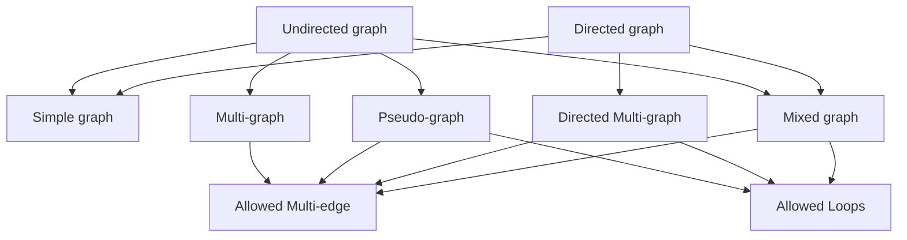

## Graph Terminology

```mermaid
graph TD
    A[Undirected graph] --> C[Simple graph]
    A[Undirected graph] --> D[Multi-graph]
    D[Multi-graph] --> G[Allowed Multi-edge]
    A[Undirected graph] --> E[Pseudo-graph]
    E[Pseudo-graph] --> G[Allowed Multi-edge]
    E[Pseudo-graph] --> H[Allowed Loops]
    A[Undirected graph] --> F[Mixed graph]
    B[Directed graph] --> C[Simple graph]
    B[Directed graph] --> I[Directed Multi-graph]
    I[Directed Multi-graph] --> G[Allowed Multi-edge]
    I[Directed Multi-graph] --> H[Allowed Loops]
    B[Directed graph] --> F[Mixed graph]
    F[Mixed graph] --> G[Allowed Multi-edge]
    F[Mixed graph] --> H[Allowed Loops]
```
## Types of graphs

| Graph | \|V\| | Degree |
|:---:  | :---: |  :---: |
|$$K_n, n \ge 1$$|n|$$\frac{n*(n-1)}{2}$$|deg(u) = n-1, $$\forall u \in V$$