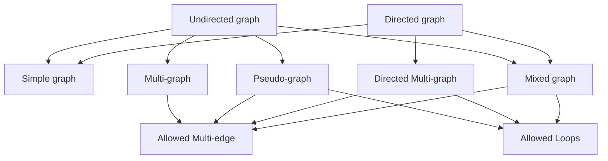

## Graph Terminology

## Types of graphs

| Graph | \|V\| | \|E\| | Degree |
|:---:  | :---: | :---: |---   |
|$$K_n, n \ge 1$$|n|$$\frac{n*(n-1)}{2}$$|deg(u) = n-1, $$\forall u \in V$$|
|$$K_{m, n} \ge 1$$|$$m+n$$|$$m*n$$|$$deg(u) = n, \forall u \in V_1; deg(v) = m, \forall v \in V_2$$|
|$$C_n, n \ge 3$$|n|n|deg(u) = 2, $$\forall u \in V$$|
|$$W_n, n \ge 3$$|$$n+1$$|n|$$deg(u) = 3, \forall u \in C_n; deg(*) = n$$|
|$$Q_n, n \ge 1$$|$$2^n$$|$$n*2^{n-1}$$|deg(u) = n|

## Bipartite graphs
- Make colors two adjacent edges differently colored.
## Representing graphs
1. Using adjacency list:
2. Using adjacency Matrix:
    - All this kind of matrix is square - symmetric, the values are not less than 0.
    - The main diagonal is the number of loops.
    - The degree of a vertex is determined by the sum of the row or column in matrix (the value of the main diagonal is doubled).
3. Using incidence matrix:
    - The column is the sequence of the vertices, and the row is the sequence of the edges.
    - The entry $$m_{i,j} = 1$$ where $$v_i$$ is a node of $$e_j$$
    - The size of the matrix: |v|.|e|
    - $$m_{i,j} \in {0,1}$$

|$$e_1$$|$$e_2$$|$$e_{...}$$|$$e_i$$|
|:-----:|:-----:|:---------:|:-----:|
|$$v_1$$| - | - | - |
|$$v_2$$| - | - | - |
|$$v_{...}$$| - | - | - |
|$$v_j$$| - | - | - |

## Isormophism of graphs
- There exists a bijection f from $$V_1$$ to $$V_2$$ and vice versa -> They are same the number of vertices, number of edges, degree.
- If the sphere discards a point, it is isormophic with the flat.
## Connectedness
1. Undirected graph:
    - There exists a path between the distinct vertices of the graph.
2. Directed graph:
    - **Strongly connected**: there is a path from a to b and vice versa whenever a and b are vertices of the graph.
    - **Weekly connected**: there is always a path between 2 vertices when the directions of the edges are disregraded.
## Counting paths between vertices
- Let A is a *adjacency matrix*, the number of different paths of **length r** from $v_i$ to $v_j$ **equals to the $$(i, j)_r$$ entry of $$A^{r}$$** ($$r \gt 0$$).
## Cut vertex & Cut edge
- Its removal will produce disconnected subgraphs from original connected graph.
## Euler paths and circuit (|V| $$\ge$$ 2)

|     | Path | Circuit |
|-----|:---:|:---:|
|Condition| No odd degree | Exactly 2 vertices of odd degree |

## Hamilton paths and circuits
G is a simple graph with n $$\ge$$ 3 vertices

|**Name**| **Theorem**  |
|:-----:|-----------------------------------------
|Dirac  |$$\forall v_i, deg(v_i) \ge \frac{n}{2}$$|
|Ore|$$\forall u, \forall v, non-adjacent, deg(u) + deg(v) \ge n$$|