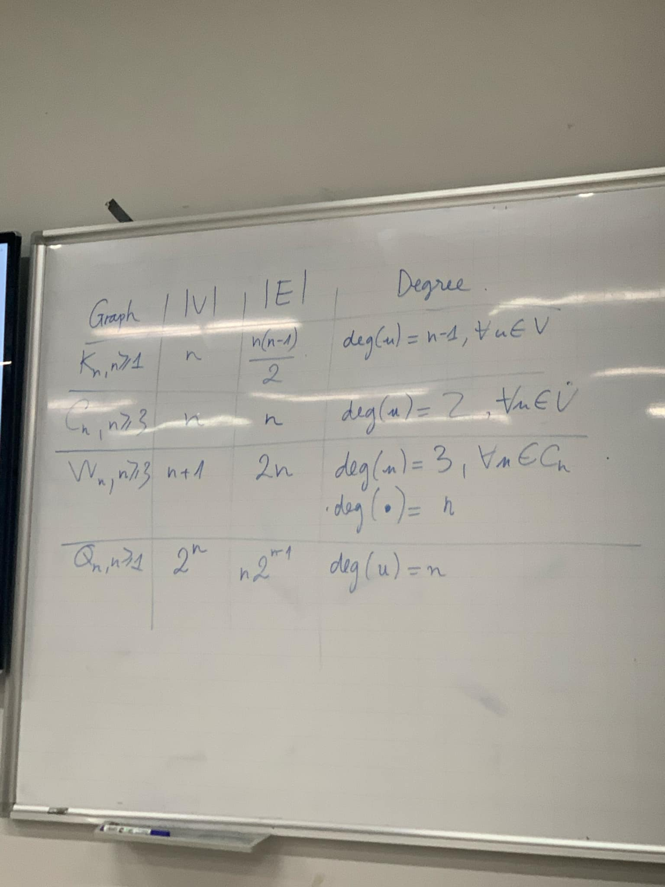
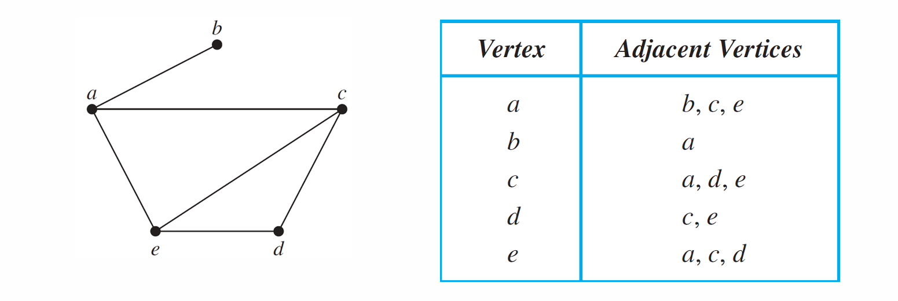
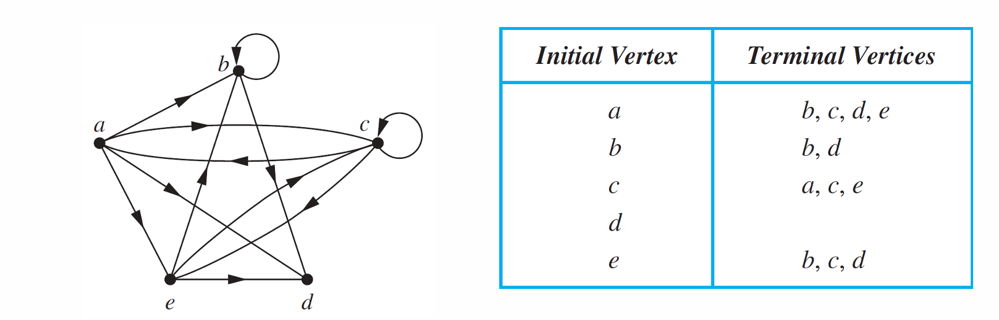
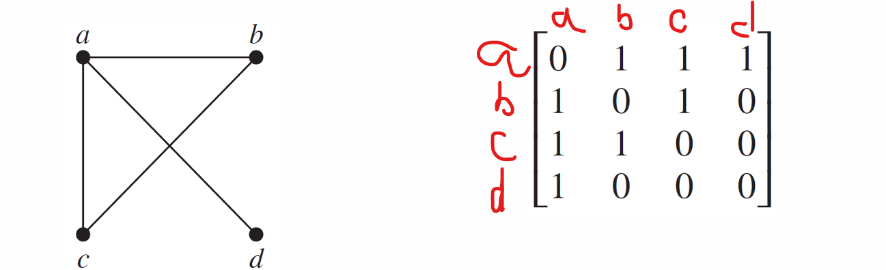
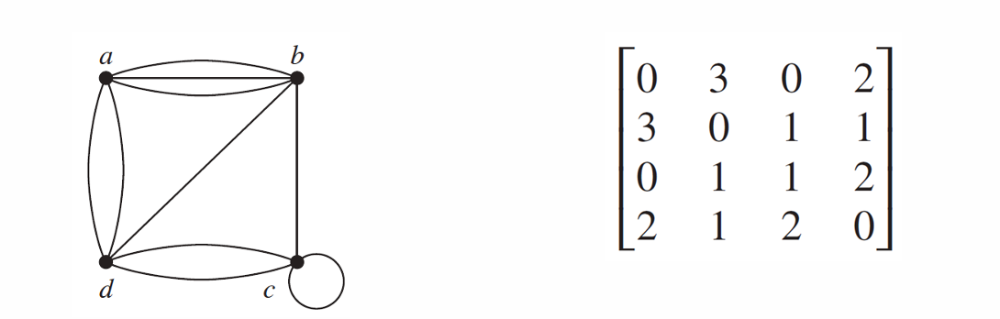
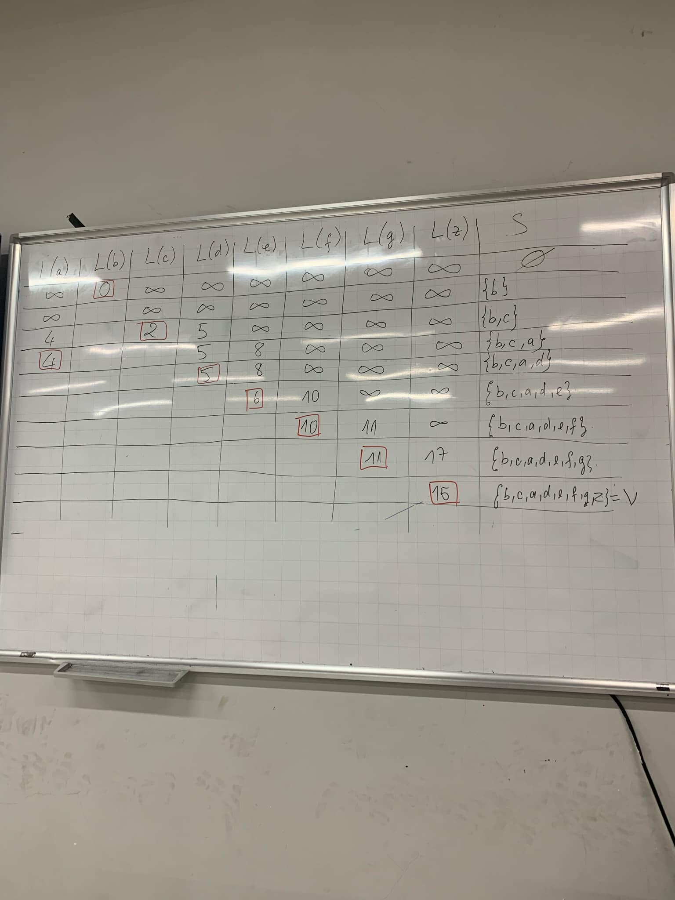

## Các dạng đồ thị

## Đồ thị lưỡng phân (Bipartite)

- Là đồ thị sẽ có 2 vùng và các đỉnh trên vùng này sẽ chỉ nối với các đỉnh ở vùng kia. Các đỉnh cùng vùng sẽ k nối với nhau.
- **_Định lí tô màu_**: Đồ thị G là lưỡng phân khi chúng ta dùng 2 màu khác nhau và tô màu các đỉnh của nó (tô xen kẻ) sau cùng nếu hai đỉnh kề nhau mà có màu khác nhau thì nó là lưỡng phân
  - VD: Khi tô đỉnh a màu đỏ và đỉnh e f g kề với đỉnh a thì e f g phải đc tô màu đỏ. nếu f lại kề với g mà hai thằng cùng đỏ thì thôi dừng luôn.
  - _Đồ thị chỉ cần có vòng c3 thì sẽ k lưỡng phân_
- Kí hiệu: Km,n (m, n >= 1)
  - K là kí hiệu lưỡng phân
  - m là số lượng tập V1
  - n là số lượng tập V2
  - Có m + n đỉnh, m \* n cạnh
  - Bậc: deg(u) = n , với mọi u thuộc V1, deg(v) = m, với mọi v thuộc V2

## Các đỉnh kề (Adjacency List)

**Đồ thị vô hướng**

- Mỗi hình chỉ cho ra được một bảng như này(quang hệ one to one)
- Vertex: liệt kê các đỉnh
- Adjacent Vertives: đỉnh kề với nó

**Đồ thị có hướng**

- Mỗi hỉnh chỉ cho ra được một bảng như này
- Initial Vertex: Các đỉnh của nó
- Terminal Vertices: các đỉnh được dẫn ra từ nó (đầu vector của đỉnh đang xét)
- Nếu đỉnh nào mà k ghi j thì nó chỉ có vào mà k có ra

## Ma trận kề (Adjacency Matrices)

**Đồ thị vô hướng**

- Mối quan hệ giữa đồ thị và ma trận này cũng là one to one
- chúng ta sẽ đếm só cạnh giữa các đỉnh đang xét xog điền vào ma trận
  
- Các ma trận này đều vuông, đối xứng và có giá trị k âm
- Trên đường chéo chính (tại điểm trùng nhau vd aa bb cc dd) sẽ là số vòng lặp (khuyên) tại điểm đó
- Để vẽ được hình từ đồ thị thì chúng ta cần bt số đỉnh, số cạnh, và dãy bậc
  - Đỉnh đã có rồi, dãy bậc ở đây chúng ta sẽ cộng dọc hoặc ngay tùy ý
  - Hãy cộng và mặc kệ đường chéo chính và sau đó nếu đường chéo chính có tại đỉnh nào thì chúng ta sẽ nhân đôi số trên đường chéo chính xog cộng vào bậc của đỉnh đó
  - Cạnh bằng số bậc cộng lại và chia đôi

## Ma trận liên thuộc (Incidence Matrices)

- có n + m đỉnh và m x n cạnh, là ma trận (n + m) x (m x n)
- Ma trận mij bằng 1 khi đỉnh vi là đầu mút của cạnh ej
- Hàng nganh là đỉnh(dòng), hàng dọc là cạnh(cột)
- Cách điền vào ma trận
  - Ta xác định xem đỉnh được nối bởi cạnh nào thì điền vào đó là 1 còn lại là 0
  - Kích thước ma trận |v|.|e|
  - mij thuộc {0, 1}

- Mỗi cột trong ma trận chỉ có ít nhất 1 và nhiều nhất 2 số 1
  - Nếu cột có 1 số 1 thì nó là khuyên, còn 2 số 1 thì bình thường
- Các xác định số bậc

  - Cộng theo hàng, ta xét từng cột xem có khuyên k
  - Nếu cột nào k có khuyên thì ta cộng bth còn nếu có khuyên thì cộng 2 với từng cái khuyên
  - VD trong hình trên ta xét đỉnh v1, ta nhận thấy cạnh e1(xét hàng dọc) chỉ có 1 số 1 thì nó là khuyên còn các cạnh còn lại có 2 số 1 nên là cạnh bình thường
    - Vậy bậc của đỉnh v1 là 2 + 1 + 1

  **Ma trận liên thuộc thì có thể là vuông hoặc chữ nhật**

## Đẳng cấu (Isomorphism of Graphs)

- Tồn tại xog ánh f cho phép ta biến hình A thành hình B
- Và cũng tồn lại f-1 để ta biến hình B thành hình A
- Nếu mặt cầu bỏ đi một điểm thì nó sẽ đẳng cấu với mặt phẳng
- [0, 1] đẳng cấu với [2, 100]
  - Cũng là hai tập vô hạn như nhau và có tồn tại công thức biến mọi phần tử trong tập 1 thành mọi phần tử trong tập 2
- Hai đồ thị G1 = (V1, E1) và G2 = (v2, E2) đẳng cấu với nhau khi tồn tại ít nhất 1 song ánh f biến tập đỉnh V1 thành tập đỉnh E2, nếu đỉnh a và b kề nhau trong tập V1 thì f(a) và f(b) cũng sẽ kề nhau trong đồ thị mới
  => Hai đồ thị đẳng cấu với nhau thì sẽ có cùng số đỉnh, số cạnh, số bậc (ngược lại thì chưa chắc)
- Nếu hai hình có đường đi có chu trình khác nhau thì cũng k đẳng cấu với nhau

## Đường đi (paths)

- Đường là cạnh của đồ thị
- Địa điểm sẽ là đỉnh của đồ thị
- Đầu và đích k trùng nhau
- **Chu trình (circuit)** là dạng đặt biệt của đường đi nhưng đầu và đích trùng nhau
- **Đồ thị đơn / đường đi đơn (simple)** với mỗi cạnh thì nó chỉ đi qua đúng 1 lần

## Liên Thông (Connectedness)

**Đồ thị vô hướng**

- gọi là liên thông thì ta hai đỉnh bất kì phải có đường đi giữa chúng.
  
- G1 là liên thông
- G2 k phải là liên thông, nó có thể tách ra thành nhiều địa bàn
- Hình thứ 3 cũng k liên thông nhưng các thành phần đc tách ra thì liên thông vs nhau

**Đồ thị có hướng**

- _Liên thông mạnh:_
  - Chỉ xảy ra khi một đỉnh phải có đường đi và đường về
- _Liên thông yếu:_

  - K phải liên thông mạnh và bỏ đi chiều và nó thành 1 đồ thị vô hướng liên thông thì nó là liên thông yếu

- G là liên thông mạnh
- H là liên thông yếu

**_Một đồ thị liên thông yếu thì có thể tách ra từ nhiều đồ thị liên thông mạnh_**
**_Một đồ thị chỉ có 1 điểm thì luôn liên thông mạnh_**

## Counting Paths Between Vertices

- B1: Viết ma trận kề của đồ thị
- B2: nếu đề yêu cầu ma trận A^r thì phải tính ma trận A^r
- B3: sau đó số giao tại điểm bắt đầu và kết thúc trong ma trận chính là số đường đi
  - VD: ta muốn tìm số đường đi từ **a tới d và ad = 8 trong ma trận** thì **số đường đi là 8**
  - **(Ôn lại các nhân / lũy thừa ma trận)**

## Đỉnh Khớp và cạnh cắt (cut vertex & cut edge)

- vd: con ốc giữa kính chiếu hậu và chiếc xe máy, nếu tháo ra thì sẽ tách xe ra làm hai thành phần liên thông thì con ốc là **đỉnh khớp**, cạnh khớp cũng tương tự, thay vì bỏ đỉnh thì bỏ cạnh mà tách thành hai khối liên thông riêng biệt thì nó là **cạnh cắt**

## Euler Paths and circuit

- Euler circuit là 1 chu trình đơn (mỗi cạnh đi qua đúng 1 lần) đi qua tất các cạnh của đồ thị
- Euler paths (đường đi euler) thì giống định nghĩa trên nhma điểm đầu vs cuối khác nhau

**Định lí (rất mạnh)**

- Một đồ thị có ít nhất 2 đỉnh trở lên thì nó có chu trình Euler (Euler circuit) khi và chỉ khi dãy bậc của các đỉnh đề là số chẳn
- Một đồ thị có đường đi Euler (Euler path) khi và chỉ khi có đúng 2 đỉnh bậc lẻ

## Hamilton Paths and Circuits

- Chu trình hamilton (circuits) là chu trình đơn đi qua hết tất cả các đỉnh của đồ thị. (mỗi đỉnh qua đúng 1 lần trừ đỉnh đầu)
- Đường đi hamilton (paths) giống ở trên nhma đầu cuối khác nhau.

**chu trình Euler k suy ra đc chu trình Hamilton và ngược lại cũng v**
**Định lí**
**_Dirac's_:**
Một đồ thị có chu trình Hamilton khi:

- Nó là đồ thị đơn
- Có ít nhất 3 đỉnh
- Bậc của mỗi đỉnh ít nhất phải bằng hoặc lớn hơn đỉnh / 2

**_Ore's_**:
Một đồ thị có chu trình Hamilton khi:

- là đồ thị đơn
- Có ít nhất 3 đỉnh
- Tổng bậc của hai đỉnh không kề ít nhất phải bằng hoặc lớn hơn số đỉnh

**Một đồ thị không có chu trình hamilton khi nó có đỉnh treo hoặc có cạnh cắt, nếu muốn có chu trình thì mỗi đỉnh bậc ít nhất cũng phải là 2**

**Một đồ thị có chu trình hamilton thì chắc chắn có đg đi hamilton**

**Một đồ thị có 2 cạnh cắt trở lên thì nó cũng k có đg đi hamilton**

## Bài toán tối ưu (Tính đường đi ít tốn time nhất và hoặc có chi phí thấp nhất)

.jpg>)

- Ta đi từ điểm nào thì điểm đó ban đầu bằng 0
- Các đỉnh chưa đi tới thì sẽ là vô cùng
- Xét cùng 1 hàng, số nhỏ nhất sẽ khoanh lại và thêm vào tập S
- Xét tiếp các đỉnh kề với đỉnh vừa nhận và chưa có trong tập S, nếu điểm vừa nhận kề vs tất cả các đỉnh có trong tập S rồi thì mình xét các đỉnh kề với đỉnh nhỏ thứ 2 trên hàng vừa xét
- Nếu đỉnh tiếp theo kề với đỉnh đang xét mà nó đã được xét trước đó r và chi phí mới của nó lớn hơn chi phí cũ xét trước đây thì sẽ nhận chi phí nhỏ hơn.
